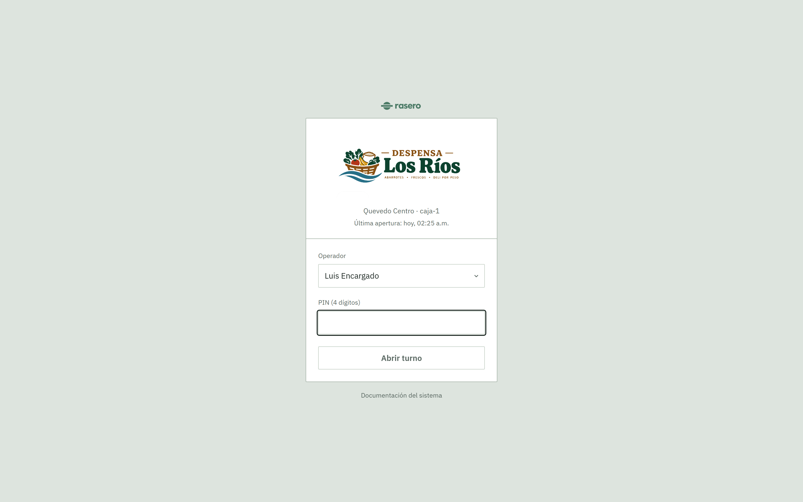
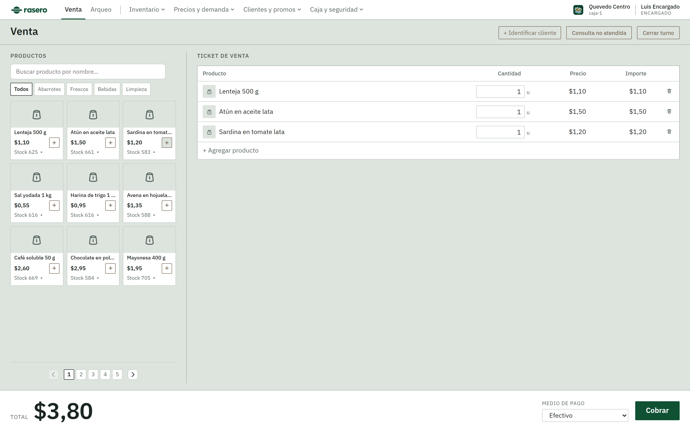
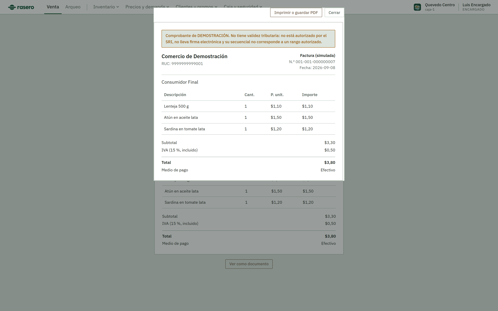
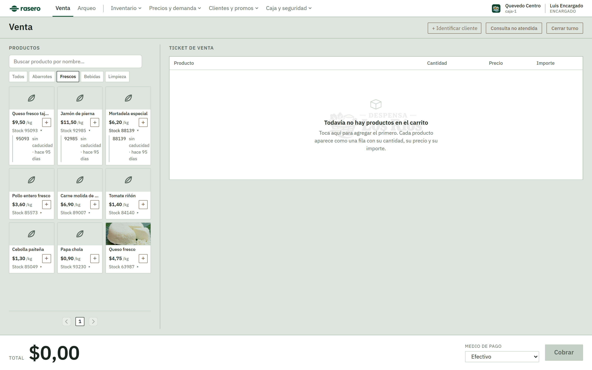
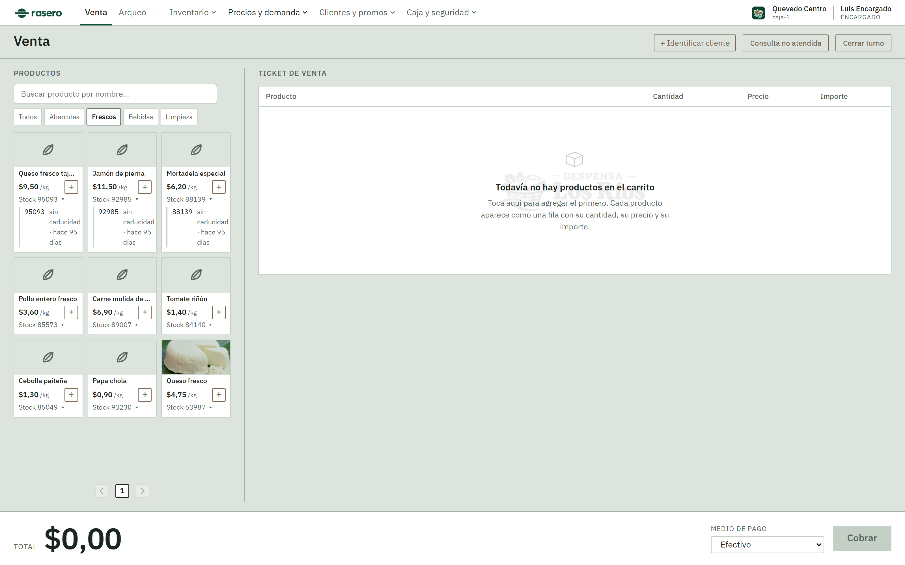
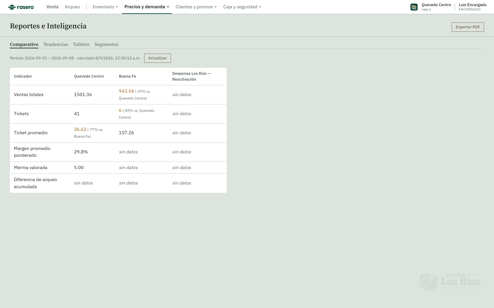
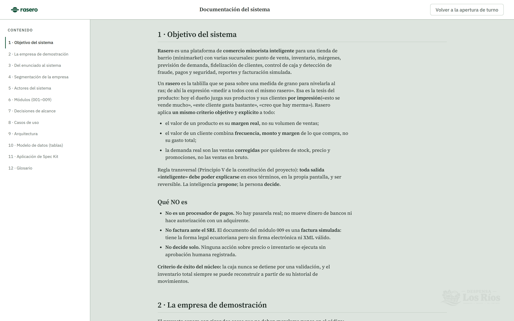
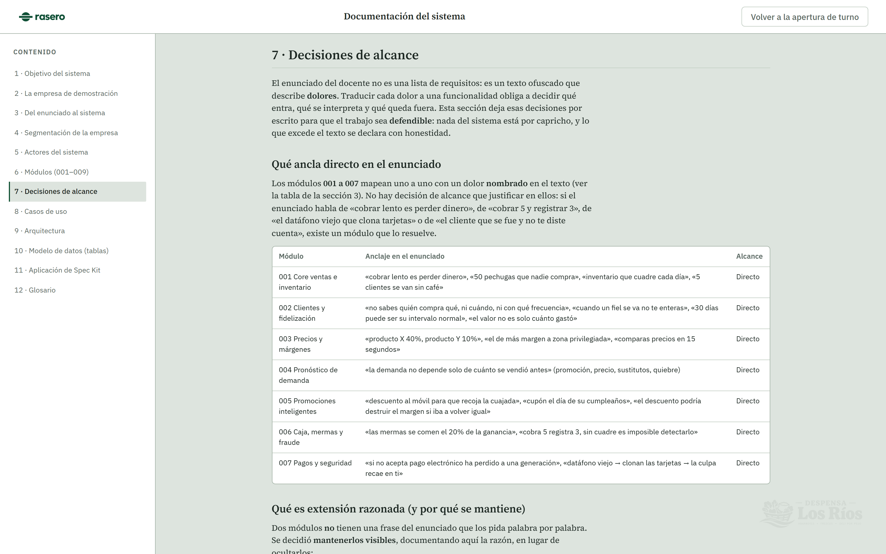

<p align="center">
  
</p>

<p align="center">
  <a href="#pruebas"></a>
  
  
  
  
</p>

---

**Rasero** es una plataforma de comercio minorista inteligente para una tienda de barrio con
varias sucursales: punto de venta, inventario, márgenes, previsión de demanda, fidelización de
clientes, control de caja, detección de fraude, pagos, seguridad, reportes y facturación simulada.

Un *rasero* es la tablilla que se pasa sobre una medida de grano para nivelarla al ras; de ahí
«medir a todos con el mismo rasero». Esa es la tesis del producto: hoy el dueño juzga sus
productos y sus clientes **por impresión** («esto se vende mucho», «este cliente gasta bastante»,
«creo que hay merma»). Rasero aplica **un mismo criterio objetivo y explícito** a todo:

- el valor de un producto es su **margen real**, no su volumen de ventas;
- el valor de un cliente combina **frecuencia, monto y margen**, no su gasto total;
- la demanda real son las ventas **corregidas** por quiebres de stock, precio y promociones.

> La inteligencia **propone**; la persona **decide**. Toda salida «inteligente» se explica en la
> propia pantalla y es reversible (Principio V de la constitución del proyecto).

---

## Contenido

- [Vistazo](#vistazo)
- [Los nueve módulos](#los-nueve-módulos)
- [Arquitectura](#arquitectura)
- [Modelo de datos](#modelo-de-datos)
- [Puesta en marcha](#puesta-en-marcha)
- [Pruebas](#pruebas)
- [Método: Spec-Kit](#método-spec-kit)
- [Alcance frente al enunciado](#alcance-frente-al-enunciado)

---

## Vistazo

<table>
  <tr>
    <td width="50%"><br><sub><b>Apertura de turno</b> — el operador se elige de una lista y confirma un PIN de 4 dígitos; el backend emite un token JWT de sesión de turno.</sub></td>
    <td width="50%"><br><sub><b>Punto de venta</b> — catálogo en grid + ticket de fila editable, venta mixta unidad/peso, selector de medio de pago, total anclado.</sub></td>
  </tr>
  <tr>
    <td width="50%"><br><sub><b>Factura simulada (009)</b> — forma de factura electrónica ecuatoriana con aviso de demostración; «Ver como documento» abre la vista previa y «Guardar como PDF».</sub></td>
    <td width="50%"><br><sub><b>Existencias por lote</b> — total en la sucursal y desglose FEFO al expandir; el color «crítico» señala lo que necesita conteo.</sub></td>
  </tr>
  <tr>
    <td width="50%"><br><sub><b>Precios y márgenes (003)</b> — margen real, rol comercial del producto y sugerencia de precio/zona que muestra qué insumos usó.</sub></td>
    <td width="50%"><br><sub><b>Reportes e inteligencia (008)</b> — comparativo entre sucursales, tendencias, tablero de KPIs y segmentación k-means; exportable a PDF.</sub></td>
  </tr>
</table>

El sistema trae además una **pantalla de Documentación** completa (objetivo, actores, los nueve
módulos, casos de uso, arquitectura, las 50 tablas de la base de datos y las decisiones de
alcance), accesible desde el enlace de la pantalla de apertura de turno.

<p align="center"></p>

---

## Los nueve módulos

Cada módulo es **dueño de sus propias entidades** de datos: los demás las consultan, nunca las
redefinen ni alteran su esquema.

| # | Módulo | Qué resuelve | Entidades propias |
|---|--------|--------------|-------------------|
| **001** | Core de ventas e inventario | Venta mixta (unidad + peso), consumo de lote por caducidad (FEFO), precio efectivo por sucursal, venta idempotente, anulación atada al turno, entradas por compra, traspasos entre sucursales, consultas no atendidas, conteo físico, capital inmovilizado, cola de operaciones offline, roles y turnos. | `sucursal`, `producto`, `lote`, `existencia`, `movimiento_inventario`, `venta`, `renglon_venta`, `turno`, `operador`… (20) |
| **002** | Clientes y fidelización | Catálogo con cumpleaños e identificador, historial de visitas, valor de cliente (frecuencia + monto + margen), intervalo de compra esperado por cliente, señal de fuga silenciosa. | `cliente`, `visita`, `intervalo_compra`, `senal_fuga` |
| **003** | Precios y márgenes | Margen real por producto, rol comercial (gancho de tráfico / generador de margen), sugerencia de precio combinando margen + rol + competencia, sugerencia de zona de exhibición. | `margen_calculado`, `rol_producto`, `sugerencia_precio`, `sugerencia_colocacion` |
| **004** | Pronóstico de demanda | Serie observada vs. corregida (descensura por quiebre, precio, promoción y sustitutos), pronóstico consultivo contra una línea base determinista. | `demanda_observada`, `demanda_corregida`, `pronostico`, `sustitucion_producto` |
| **005** | Promociones inteligentes | Tres mecanismos separados: cupón por fecha fija (cumpleaños), oferta de recompra con reserva de precio, experimento de reactivación con grupo de control e incrementalidad (prueba z). | `campania`, `cupon`, `oferta_recompra`, `experimento_reactivacion`, `asignacion_experimento`, `redencion_promocion` |
| **006** | Caja, mermas y fraude | Arqueo de caja por turno, clasificación de la causa de un descuadre como merma, detección de sub-registro cruzando inventario contra ventas por operador, gestión de anomalías. | `arqueo`, `merma`, `anomalia_caja` |
| **007** | Pagos y seguridad | Cobertura de medios de pago por sucursal, registro de terminales y vigilancia de firmware / exposición a clonación, tokenización de tarjeta (nunca el PAN ni el CVV), bitácora de auditoría de solo anexado. | `medio_pago`, `terminal_pago`, `cobertura_pago`, `bitacora_auditoria`, `token_pago` |
| **008** | Reportes e inteligencia | Capa de solo lectura sobre 001–007: comparativo entre sucursales, tendencias por semana/mes, tablero de KPIs, segmentación de clientes por k-means (semilla fija, reversible). | `agregado_reporte`, `segmento_cliente`, `asignacion_segmento` (derivadas) |
| **009** | Facturación electrónica (simulada) | Documento con la forma de una factura ecuatoriana (RUC, secuencial, subtotal, IVA, total, «Consumidor Final») tras una venta confirmada. Sin SRI, sin firma, sin XML. | `factura_simulada` |

---

## Arquitectura

```
Frontend  ──  SPA React 18 + Vite + TypeScript
              Sistema de diseño propio (sin Bootstrap / MUI). Una pantalla por módulo bajo
              un armazón con navegación por rol. Sesión (turno + token) en memoria. Gráficos
              con Recharts. Cola offline que reenvía lo trabajado sin conexión en orden de origen.
                     │  HTTP/JSON  ·  Authorization: Bearer <token de turno>
Backend   ──  FastAPI (Python), en capas
              api/ (routers por módulo, un error handler que nunca filtra trazas)
                → servicios/ (orquestación y transacciones)
                → dominio/ (reglas puras: márgenes, censura, k-means, arqueo, tokenización…)
                → persistencia/ (SQLAlchemy 2.x, registro de movimientos)
              Autorización y sesión centralizadas en seguridad.py.
                     │  SQLAlchemy
Datos     ──  PostgreSQL  ·  50 tablas  ·  14 migraciones Alembic reversibles
              Dinero y peso en NUMERIC de precisión fija (nunca coma flotante). SQLite prohibido.
              El inventario se reconstruye entero desde movimiento_inventario.
```

**Principios no negociables:** la caja nunca se detiene por una función de IA, analítica o
telemetría · toda operación que mueve inventario, dinero o documentos es idempotente · lo
ejecutado sin conexión se reconcilia por orden real de ocurrencia · el PAN, el CVV y la banda de
una tarjeta no se almacenan en ningún módulo · todo dato incierto se marca con **tres portadores**
(color + forma + texto), nunca solo color.

---

## Modelo de datos

Las 50 tablas están documentadas **columna por columna** (tipo, claves, restricciones `CHECK`)
dentro de la propia aplicación, en la sección *10 · Modelo de datos* de la pantalla de
Documentación. La fuente de verdad del esquema es
[`backend/rasero/persistencia/modelos.py`](backend/rasero/persistencia/modelos.py); las
migraciones viven en [`backend/migraciones/versions/`](backend/migraciones/versions/).

- **Nomenclatura:** español, `snake_case`, singular, sin «ñ»; claves foráneas `id_` + tabla referida.
- **Precisión exacta:** `NUMERIC(p,e)` para dinero y gramos; instantes en UTC (`timestamptz`).
- **Trazabilidad:** sobrescribir una cantidad de inventario sin registrar el movimiento que la
  origina está prohibido.

---

## Puesta en marcha

### Requisitos

- Python **3.12+**
- Node **20+**
- PostgreSQL **16+**, escuchando en el puerto **5442** (no 5432, para no colisionar con otros
  proyectos), con una base y un rol llamados `rasero`.

### Backend

```bash
cd backend
python -m venv .venv
.venv/Scripts/activate            # Windows ·  source .venv/bin/activate en Linux/macOS
pip install -e .

export DATABASE_URL="postgresql+psycopg://rasero@localhost:5442/rasero"

python -m alembic -c migraciones/alembic.ini upgrade head    # crea las 50 tablas
python -m rasero.semilla                                     # operadores + sucursales + catálogo base
python -m rasero.semilla_catalogo                            # catálogo de demostración
python -m rasero.semilla_movimientos                         # ventas e inventario de ejemplo
python -m rasero.semilla_clientes                            # clientes con historial
python -m rasero.semilla_reactivacion                        # escenario de fuga y reactivación
python -m rasero.semilla_pagos                               # medios de pago y cobertura

python -m uvicorn rasero.api.aplicacion:app --port 8000
```

### Frontend

```bash
cd frontend
npm install
npm run dev          # http://localhost:5173  (espera el backend en http://localhost:8000)
```

### Acceso de demostración

`python -m rasero.semilla` imprime los operadores que crea. Por defecto:

| Operador | Rol | PIN |
|----------|-----|-----|
| Ana Cajera | `cajero` | `1234` |
| Luis Encargado | `encargado` | `9999` |
| Marta Administradora | `admin` | `0000` |

---

## Pruebas

La suite corre con **pytest**, contra un PostgreSQL real (nunca SQLite). Debe ejecutarse desde
la raíz del repositorio, con el intérprete del entorno virtual del backend:

```bash
backend/.venv/Scripts/python.exe -m pytest -q      # Windows
backend/.venv/bin/python -m pytest -q              # Linux/macOS
```

```
489 passed, 1 skipped
```

Cubre: aritmética de dinero, transiciones de estado del inventario, idempotencia, FEFO,
descensura de demanda, k-means determinista, la prueba z del experimento de reactivación,
arqueo, tokenización, autorización por rol y sesión de turno, y los contratos públicos de la API.

---

## Método: Spec-Kit

El proyecto se construyó **módulo por módulo** con desarrollo dirigido por especificación:

```
/speckit-constitution   6 principios no negociables + 6 «Lecturas Críticas del Enunciado»
        ↓ gobierna       + tabla de propiedad de datos  (va por la versión 2.7.2)
/speckit-specify         spec.md — user stories priorizadas, escenarios Given/When/Then,
        ↓                requisitos funcionales numerados, casos límite
/speckit-clarify         hasta 5 preguntas a lo ambiguo, grabadas en el propio spec
        ↓
/speckit-plan            plan.md, data-model.md, research.md — con «Constitution Check»
        ↓
/speckit-tasks           tasks.md — lista ordenada por dependencias
        ↓
/speckit-implement · /speckit-analyze · /speckit-converge
```

Las especificaciones de los nueve módulos están en [`specs/`](specs/); la constitución en
[`.specify/memory/constitution.md`](.specify/memory/constitution.md). `DESIGN.md` **no** se
escribió al principio: se derivó de la interfaz ya construida, al final.

---

## Alcance frente al enunciado

El caso de negocio lo entregó el docente como un **texto ofuscado** (nombres reales sustituidos
por palabras sin sentido) que hay que **interpretar**. Los módulos **001–007** mapean uno a uno
con un dolor nombrado en el texto. Los módulos **008** (reportes) y **009** (facturación) son
**extensión razonada** —el enunciado no los pide literalmente— y están documentados como tales
en la sección *7 · Decisiones de alcance* de la aplicación: 009 es explícitamente una **factura
simulada**, sin validez tributaria, con aviso visible.

<p align="center">
  
</p>

---

<sub>Proyecto académico. «Despensa Los Ríos» y sus sucursales son datos de demostración; no
aparecen en ningún identificador técnico. Rasero es la herramienta; el comercio de ejemplo es
solo un juego de semillas.</sub>
